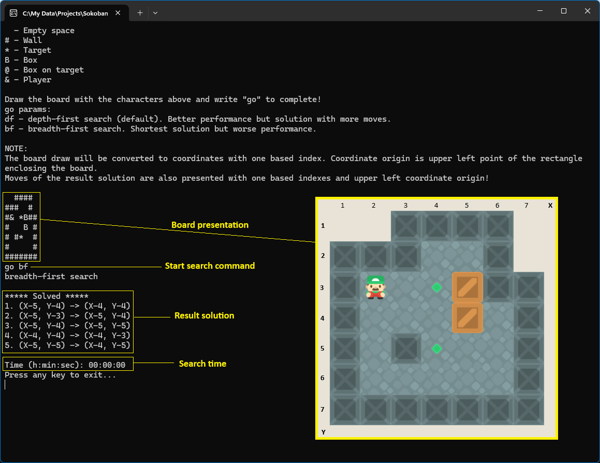

# Sokoban-solver
Simple brute force tool, solving Sokoban puzzles.
Not applicable to boards with many boxes because of progressive branching of the possible moves. Usually solves puzzles with up to 7 boxes.
Tipical solving time:
4 - instant result
5 - seconds
6 - minutes
7 - dozens of minutes
Performance could be improvet with extension of FilterBoardConditions and FilterMovements methods - will reduce branches of the tree.

